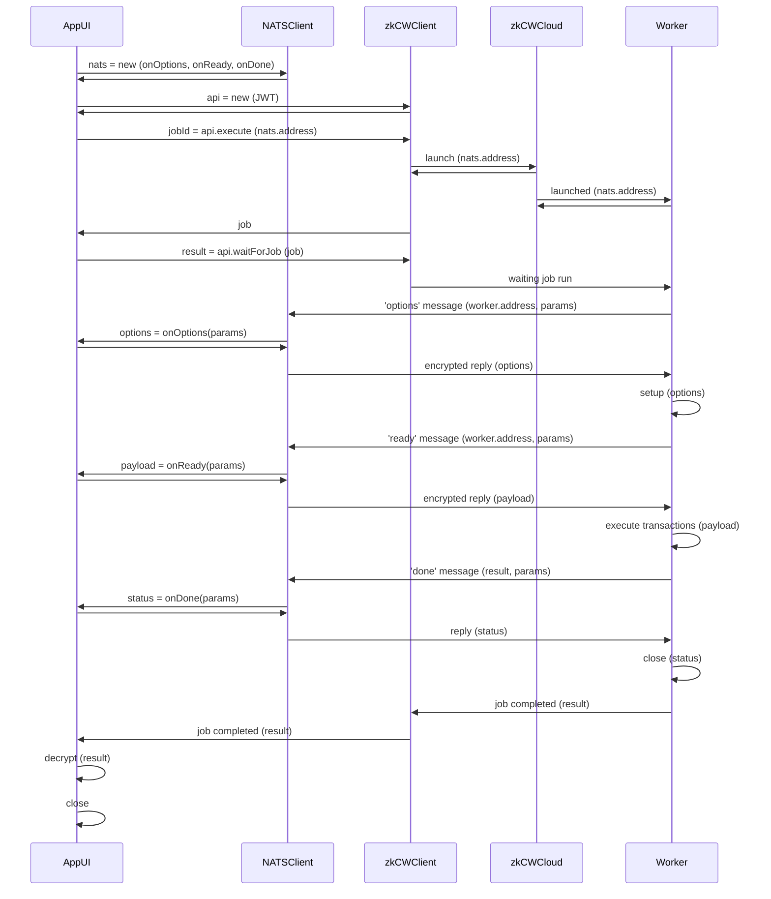

# Client / Worker encryption

An example with encryption between client and workers.

The original [Trust assumption: encrypting all the data that is being sent and stored](https://docs.zkcloudworker.com/privacy#trust-assumption-encrypting-all-the-data-that-is-being-sent-and-stored) has been slightly modified 
on implementation, but keeping all mentioned trust assumptions.

The following graph shows the (updated) event flow between App and Worker:



**Componentes**:

- `App UI`

- `zkCloudWorkerClient (zkCW Client)`

- `NATS Client`

- `zkCloudWorkerCloud (zkCW Cloud)`

- `zkCloudWorker (Worker)`

**On handshaking encryption**:

To preserve **privacy between the AppUI and the zkCloudWorker Worker**, we use a set of "crossed" key pairs which are created exclusively for this particular client<>worker interaction, and will be destroyed when the worker has finished.

- On start the App will create a new NATSClient that will manage encrypted interactions between App and Worker.
- This NATSClient will create a public/private key pair {cpk, csk} for itself.
- When connecting with the zkCWCloud the zkCWClient will send the NATSClient public key (cpk) to the Launcher. 
- This client public key (cpk) will be used by the zkCloudWorker Worker to encrypt its responses to the App.
- When launching a new worker, the worker will also create a new  public/private key pair {wpk, wsk} for itself
- The worker will return this public key (wpk) to the App when sending NATS messages 'option' and 'ready'. 
- The received worker's public key (wpk) will be used by the NATSClient to encrypt the replies sent back to the worker.
- The worker can decrypt the payloads sent by the client using the worker secret key (wsk).
- The App can decrypt the responses from the worker using its client secret key (csk).

As can bee seen, private keys are never exchanged and never leave its corresponding environment. Also the created used private keys are fully destroyed when the worker completes its work.

So we can consider this to be **a secure private exchange between the App (in the browser) and the worker (in the cloud)**.


## Installation

You need to install `node (v20+)` and `git` and clone this repo

```
git clone https://github.com/zkcloudworker/encryption-example
cd encryption-example
```

## Deploy

Install zkCloudWorker CLI tool
```sh
npm install -g zkcloudworker-cli
```

Deploy this repo to zkCloudWorker cloud. 
```sh
zkcw deploy
```

or, in verbose mode
```sh
zkcw deploy -v
```

**IMPORTANT**: 

- Carefully setup the `name` field  in the `package.json` file. It will 
  became the name of your worker and latter will be needed to start the worker.

- Also set the `author` field  in the `package.json` file.

## Run worker test 

Run:
```sh
yarn test
```

Result will be something like:
```
zkCloudWorker Encryption Example (c) MAZ 2024 www.zkcloudworker.com
Cliente address  B62qrituSSfnCsMPUhaJL7Y3fsG5q4Tfe4FVPixvJ2Kb1bXjKQx5T3V
Subscribed to subject zkcw:B62qrituSSfnCsMPUhaJL7Y3fsG5q4Tfe4FVPixvJ2Kb1bXjKQx5T3V

API response: {
  success: true,
  jobId: '6459034946.1715595991491.RciI8xL92WDsfnJtvXPca35UQ5NFVRXu',
  result: undefined,
  error: undefined
}

Waiting for job ...

Received 'options' message from worker
Worker publicKey:  B62qoRHLe6VJjKgYkTCoHLydMU9oJrK9JoSUYnCZWXjYthXH53nubwZ
options: { envEncryptionKey: '1234' }
Encrypted options:  {"publicKey":{"x":"13622864189438267871347735810741066946381147053919465481614484643137174023687","y":"8854620549187603245412174695408821252187265168187075269664854311151893652993"},"cipherText":["27487732948062051792121037014307044804769123473109992015515785327339861670078","13374815011783975565404278979260731318568994480116366356798822930078419763527"]}

Received 'ready' message from worker
Worker publicKey:  B62qoRHLe6VJjKgYkTCoHLydMU9oJrK9JoSUYnCZWXjYthXH53nubwZ
payload: { value: '77' }
Encrypted payload:  {"publicKey":{"x":"13755891266685724319143167455509060694717955041686076458102952921149606151845","y":"12237248404191713369360713635880917609408314569531474488940739391968087048514"},"cipherText":["19646213283529703187443817791122578735499648378490330439903442605947506710241","4752673553558730396705704940430289540774650289741206557457446156976132783345"]}
2024-05-13T10:26:31.678Z        INFO    worker {
  command: 'execute',
  id: '6459034946',
  jobId: '6459034946.1715595991491.RciI8xL92WDsfnJtvXPca35UQ5NFVRXu',
  developer: 'MAZ',
  repo: 'encryption-example',
  args: '{"clientAddress":"B62qrituSSfnCsMPUhaJL7Y3fsG5q4Tfe4FVPixvJ2Kb1bXjKQx5T3V"}'
}

2024-05-13T10:26:31.727Z        INFO    zkCloudWorker Execute start: {
  command: 'execute',
  developer: 'MAZ',
  repo: 'encryption-example',
  id: '6459034946',
  jobId: '6459034946.1715595991491.RciI8xL92WDsfnJtvXPca35UQ5NFVRXu',
  job: {
    metadata: 'Run encrypted comms',
    logStreams: [],
    task: 'create-proof',
    maxAttempts: 0,
    args: '{"clientAddress":"B62qrituSSfnCsMPUhaJL7Y3fsG5q4Tfe4FVPixvJ2Kb1bXjKQx5T3V"}',
    timeCreated: 1715595991491,
    timeCreatedString: '2024-05-13T10:26:31.491Z',
    jobId: '6459034946.1715595991491.RciI8xL92WDsfnJtvXPca35UQ5NFVRXu',
    repo: 'encryption-example',
    developer: 'MAZ',
    chain: 'devnet',
    txNumber: 1,
    jobStatus: 'created',
    id: '6459034946'
  }
}

2024-05-13T10:26:31.732Z        INFO    RSS memory start: 78 MB, changed by 2 MB

2024-05-13T10:26:31.747Z        INFO    CloudWorker: constructor {
  id: '6459034946',
  jobId: '6459034946.1715595991491.RciI8xL92WDsfnJtvXPca35UQ5NFVRXu',
  developer: 'MAZ',
  repo: 'encryption-example',
  task: 'create-proof',
  taskId: undefined,
  userId: undefined,
  args: '{"clientAddress":"B62qrituSSfnCsMPUhaJL7Y3fsG5q4Tfe4FVPixvJ2Kb1bXjKQx5T3V"}',
  metadata: 'Run encrypted comms',
  cache: '/mnt/efs/cache',
  chain: 'devnet',
  webhook: undefined
}

2024-05-13T10:26:31.781Z        INFO    getWorker result: {
  repo: 'encryption-example',
  size: 7477676,
  version: '0.1.6',
  developer: 'MAZ',
  countUsed: 2,
  timeUsed: 1715594554597,
  timeDeployed: 1715425147311,
  id: '6459034946',
  protected: false
}

2024-05-13T10:26:31.781Z        INFO    Running worker { developer: 'MAZ', repo: 'encryption-example', version: '0.1.6' }

2024-05-13T10:26:35.485Z        INFO    Task: create-proof

2024-05-13T10:26:35.494Z        INFO    Args: {"clientAddress":"B62qrituSSfnCsMPUhaJL7Y3fsG5q4Tfe4FVPixvJ2Kb1bXjKQx5T3V"}

2024-05-13T10:26:35.494Z        INFO    Version: 0.1.6

2024-05-13T10:26:35.494Z        INFO    Caller is:  B62qrituSSfnCsMPUhaJL7Y3fsG5q4Tfe4FVPixvJ2Kb1bXjKQx5T3V

2024-05-13T10:26:36.046Z        INFO    Response:  {
  success: true,
  data: {
    command: 'options',
    encrypted: '{"publicKey":{"x":"13622864189438267871347735810741066946381147053919465481614484643137174023687","y":"8854620549187603245412174695408821252187265168187075269664854311151893652993"},"cipherText":["27487732948062051792121037014307044804769123473109992015515785327339861670078","13374815011783975565404278979260731318568994480116366356798822930078419763527"]}'
  }
}

2024-05-13T10:26:36.159Z        INFO    Options:  {"envEncryptionKey":"1234"}

2024-05-13T10:26:36.667Z        INFO    Response:  {
  success: true,
  data: {
    command: 'execute',
    encrypted: '{"publicKey":{"x":"13755891266685724319143167455509060694717955041686076458102952921149606151845","y":"12237248404191713369360713635880917609408314569531474488940739391968087048514"},"cipherText":["19646213283529703187443817791122578735499648378490330439903442605947506710241","4752673553558730396705704940430289540774650289741206557457446156976132783345"]}'
  }
}

2024-05-13T10:27:11.790Z        INFO    Compiled time=35.018secs

2024-05-13T10:27:11.790Z        INFO    CloudWorker: Generating the proof for value 77


Received 'done' message from worker
done:  { success: true }
2024-05-13T10:27:42.417Z        INFO    CloudWorker: Verification result: true

2024-05-13T10:27:44.014Z        INFO    Response:  {
  success: true,
  data: { command: 'close', status: '{"success":true}' }
}

2024-05-13T10:27:44.111Z        INFO    RSS memory finished: 951 MB, changed by 873 MB

2024-05-13T10:27:44.112Z        INFO    zkCloudWorker Execute Sync: 1:12.365 (m:ss.mmm)

2024-05-13T10:27:44.161Z        INFO    zkCloudWorker Execute: 1:12.434 (m:ss.mmm)

REPORT RequestId: Duration: 72503.24 ms Billed Duration: 72504 ms       Memory Size: 10240 MB   Max Memory Used: 1945 MB

Job encrypted result: {
  "success": true,
  "result": {
    "metadata": "Run encrypted comms",
    "logStreams": [
      {
        "logGroupName": "/aws/lambda/zkcloudworker-dev-worker",
        "logStreamName": "2024/05/13/[$LATEST]d607b12ca5064966928a593e1563bec4",
        "awsRequestId": "b450b967-fe18-481c-ac23-42c126b0509a"
      }
    ],
    "task": "create-proof",
    "maxAttempts": 1,
    "args": "{\"clientAddress\":\"B62qrituSSfnCsMPUhaJL7Y3fsG5q4Tfe4FVPixvJ2Kb1bXjKQx5T3V\"}",
    "timeFinished": 1715596064112,
    "timeCreated": 1715595991491,
    "timeCreatedString": "2024-05-13T10:26:31.491Z",
    "jobId": "6459034946.1715595991491.RciI8xL92WDsfnJtvXPca35UQ5NFVRXu",
    "result": "\"{\\\"publicKey\\\":{\\\"x\\\":\\\"5543080912963729714602162864806574206968310074493688992451951115103974062558\\\",\\\"y\\\":\\\"8267521354669881305743830915028159195608252387668109964066125748134280339590\\\"},\\\"cipherText\\\":[\\\"8146391990042820986628611405735818509665109109276484587253200298076089922855\\\",\\\"2532776321798029037713920444303237802237573910551495264280592278353074726254\\\",
    ...
    \\\"22464366447725262352739813618208559230695883223972930585862843983329448986911\\\"]}\"",
    "repo": "encryption-example",
    "developer": "MAZ",
    "chain": "devnet",
    "txNumber": 1,
    "jobStatus": "used",
    "timeUsed": 1715596068103,
    "billedDuration": 72385,
    "id": "6459034946",
    "timeStarted": 1715595991718,
    "logs": [
      "2024-05-13T10:26:31.678Z\tINFO\tworker {\n  command: 'execute',\n  id: '6459034946',\n  jobId: '6459034946.1715595991491.RciI8xL92WDsfnJtvXPca35UQ5NFVRXu',\n  developer: 'MAZ',\n  repo: 'encryption-example',\n  args: '{\"clientAddress\":\"B62qrituSSfnCsMPUhaJL7Y3fsG5q4Tfe4FVPixvJ2Kb1bXjKQx5T3V\"}'\n}\n",
      "2024-05-13T10:26:31.727Z\tINFO\tzkCloudWorker Execute start: {\n  command: 'execute',\n  developer: 'MAZ',\n  repo: 'encryption-example',\n  id: '6459034946',\n  jobId: '6459034946.1715595991491.RciI8xL92WDsfnJtvXPca35UQ5NFVRXu',\n  job: {\n    metadata: 'Run encrypted comms',\n    logStreams: [],\n    task: 'create-proof',\n    maxAttempts: 0,\n    args: '{\"clientAddress\":\"B62qrituSSfnCsMPUhaJL7Y3fsG5q4Tfe4FVPixvJ2Kb1bXjKQx5T3V\"}',\n    timeCreated: 1715595991491,\n    timeCreatedString: '2024-05-13T10:26:31.491Z',\n    jobId: '6459034946.1715595991491.RciI8xL92WDsfnJtvXPca35UQ5NFVRXu',\n    repo: 'encryption-example',\n    developer: 'MAZ',\n    chain: 'devnet',\n    txNumber: 1,\n    jobStatus: 'created',\n    id: '6459034946'\n  }\n}\n",
      "2024-05-13T10:26:31.732Z\tINFO\tRSS memory start: 78 MB, changed by 2 MB\n",
      "2024-05-13T10:26:31.747Z\tINFO\tCloudWorker: constructor {\n  id: '6459034946',\n  jobId: '6459034946.1715595991491.RciI8xL92WDsfnJtvXPca35UQ5NFVRXu',\n  developer: 'MAZ',\n  repo: 'encryption-example',\n  task: 'create-proof',\n  taskId: undefined,\n  userId: undefined,\n  args: '{\"clientAddress\":\"B62qrituSSfnCsMPUhaJL7Y3fsG5q4Tfe4FVPixvJ2Kb1bXjKQx5T3V\"}',\n  metadata: 'Run encrypted comms',\n  cache: '/mnt/efs/cache',\n  chain: 'devnet',\n  webhook: undefined\n}\n",
      "2024-05-13T10:26:31.781Z\tINFO\tgetWorker result: {\n  repo: 'encryption-example',\n  size: 7477676,\n  version: '0.1.6',\n  developer: 'MAZ',\n  countUsed: 2,\n  timeUsed: 1715594554597,\n  timeDeployed: 1715425147311,\n  id: '6459034946',\n  protected: false\n}\n",
      "2024-05-13T10:26:31.781Z\tINFO\tRunning worker { developer: 'MAZ', repo: 'encryption-example', version: '0.1.6' }\n",
      "2024-05-13T10:26:35.485Z\tINFO\tTask: create-proof\n",
      "2024-05-13T10:26:35.494Z\tINFO\tArgs: {\"clientAddress\":\"B62qrituSSfnCsMPUhaJL7Y3fsG5q4Tfe4FVPixvJ2Kb1bXjKQx5T3V\"}\n",
      "2024-05-13T10:26:35.494Z\tINFO\tVersion: 0.1.6\n",
      "2024-05-13T10:26:35.494Z\tINFO\tCaller is:  B62qrituSSfnCsMPUhaJL7Y3fsG5q4Tfe4FVPixvJ2Kb1bXjKQx5T3V\n",
      "2024-05-13T10:26:36.046Z\tINFO\tResponse:  {\n  success: true,\n  data: {\n    command: 'options',\n    encrypted: '{\"publicKey\":{\"x\":\"13622864189438267871347735810741066946381147053919465481614484643137174023687\",\"y\":\"8854620549187603245412174695408821252187265168187075269664854311151893652993\"},\"cipherText\":[\"27487732948062051792121037014307044804769123473109992015515785327339861670078\",\"13374815011783975565404278979260731318568994480116366356798822930078419763527\"]}'\n  }\n}\n",
      "2024-05-13T10:26:36.159Z\tINFO\tOptions:  {\"envEncryptionKey\":\"1234\"}\n",
      "2024-05-13T10:26:36.667Z\tINFO\tResponse:  {\n  success: true,\n  data: {\n    command: 'execute',\n    encrypted: '{\"publicKey\":{\"x\":\"13755891266685724319143167455509060694717955041686076458102952921149606151845\",\"y\":\"12237248404191713369360713635880917609408314569531474488940739391968087048514\"},\"cipherText\":[\"19646213283529703187443817791122578735499648378490330439903442605947506710241\",\"4752673553558730396705704940430289540774650289741206557457446156976132783345\"]}'\n  }\n}\n",
      "2024-05-13T10:27:11.790Z\tINFO\tCompiled time=35.018secs\n",
      "2024-05-13T10:27:11.790Z\tINFO\tCloudWorker: Generating the proof for value 77\n",
      "2024-05-13T10:27:42.417Z\tINFO\tCloudWorker: Verification result: true\n",
      "2024-05-13T10:27:44.014Z\tINFO\tResponse:  {\n  success: true,\n  data: { command: 'close', status: '{\"success\":true}' }\n}\n",
      "2024-05-13T10:27:44.111Z\tINFO\tRSS memory finished: 951 MB, changed by 873 MB\n",
      "2024-05-13T10:27:44.112Z\tINFO\tzkCloudWorker Execute Sync: 1:12.365 (m:ss.mmm)\n",
      "2024-05-13T10:27:44.161Z\tINFO\tzkCloudWorker Execute: 1:12.434 (m:ss.mmm)\n",
      "REPORT RequestId: Duration: 72503.24 ms\tBilled Duration: 72504 ms\tMemory Size: 10240 MB\tMax Memory Used: 1945 MB\t\n"
    ],
    "isFullLog": true
  }
}

Decrypted result: {
  "publicInput": [],
  "publicOutput": [],
  "maxProofsVerified": 0,
  "proof": "KChzdGF0ZW1lbnQoKH...KSkpKSk="
}
```
