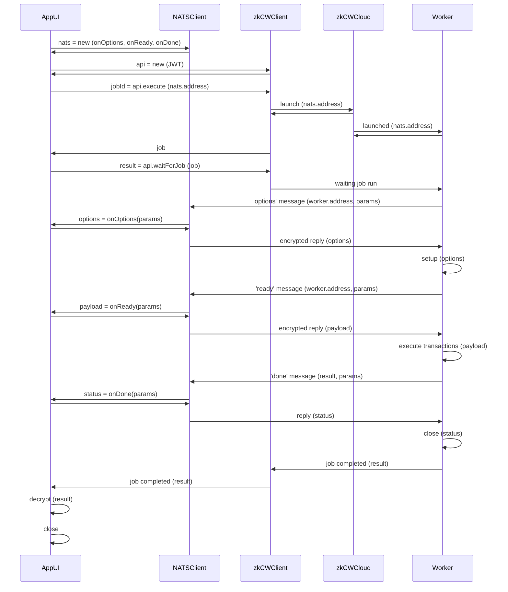

# Client / Worker encryption

An example with encryption between client and workers.

The original [Trust assumption: encrypting all the data that is being sent and stored](https://docs.zkcloudworker.com/privacy#trust-assumption-encrypting-all-the-data-that-is-being-sent-and-stored) has been slightly modified 
on implementation, but keeping all mentioned trust assumptions.

The following graph shows the (updated) event flow between App and Worker:



**Componentes**:

- `App UI`

- `zkCloudWorkerClient (zkCW Client)`

- `NATS Client`

- `zkCloudWorkerCloud (zkCW Cloud)`

- `zkCloudWorker (Worker)`

**On handshaking encryption**:

To preserve **privacy between the AppUI and the zkCloudWorker Worker**, we use a set of "crossed" key pairs which are created exclusively for this particular client<>worker interaction, and will be destroyed when the worker has finished.

- On start the App will create a new NATSClient that will manage encrypted interactions between App and Worker.
- This NATSClient will create a public/private key pair {cpk, csk} for itself.
- When connecting with the zkCWCloud the zkCWClient will send the NATSClient public key (cpk) to the Launcher. 
- This client public key (cpk) will be used by the zkCloudWorker Worker to encrypt its responses to the App.
- When launching a new worker, the worker will also create a new  public/private key pair {wpk, wsk} for itself
- The worker will return this public key (wpk) to the App when sending NATS messages 'option' and 'ready'. 
- The received worker's public key (wpk) will be used by the NATSClient to encrypt the replies sent back to the worker.
- The worker can decrypt the payloads sent by the client using the worker secret key (wsk).
- The App can decrypt the responses from the worker using its client secret key (csk).

As can bee seen, private keys are never exchanged and never leave its corresponding environment. Also the created used private keys are fully destroyed when the worker completes its work.

So we can consider this to be **a secure private exchange between the App (in the browser) and the worker (in the cloud)**.


## Installation

You need to install `node (v20+)` and `git` and clone this repo

```
git clone https://github.com/zkcloudworker/encryption-example
cd encryption-example
```

## Deploy

Install zkCloudWorker CLI tool
```sh
npm install -g zkcloudworker-cli
```

Deploy this repo to zkCloudWorker cloud. 
```sh
zkcw deploy
```

or, in verbose mode
```sh
zkcw deploy -v
```

**IMPORTANT**: 

- Carefully setup the `name` field  in the `package.json` file. It will 
  became the name of your worker and latter will be needed to start the worker.

- Also set the `author` field  in the `package.json` file.

## Run worker

Run:
```sh
yarn start
```

Result will be something like:
```
zkCloudWorker Encryption Example (c) MAZ 2024 www.zkcloudworker.com
Cliente address  B62qiVuBBCk5aF8bm3v7UaEqGWgNST15hFKFExtqmo8nwk64SYdcwLh
Subscribed to subject zkcw:B62qiVuBBCk5aF8bm3v7UaEqGWgNST15hFKFExtqmo8nwk64SYdcwLh

Received 'ready' message from worker
Worker publicKey:  B62qqk5dALC4eCgKb7kSbLi44iYQUq6MPRECE2W43JRxW6LoU2KXGhe
Encrypted payload:  {"publicKey":{"x":"25476898098064259076003805219226879273334631117873528936072169908448924793110","y":"25646834358041273257285189826202541460474335276871229308619099108864297631297"},"cipherText":["25539798367167257483827592514357132009094924897232139063690840345770783023789","19857738657151092889717587413214970956629240115294381901226384857206618440143"]}

Received 'done' message from worker
API response: {
  success: true,
  jobId: '6459034946.1715122827087.c9EDS60VlFx0uiFMfXpCKer33MT0JtBT',
  result: undefined,
  error: undefined
}
Waiting for job ...
Received 'done' message from worker
Job encrypted result: {
  "success": true,
  "result": {
    "metadata": "Run encrypted comms",
    "task": "create-proof",
    "maxAttempts": 1,
    "args": "{\"clientAddress\":\"B62qiVuBBCk5aF8bm3v7UaEqGWgNST15hFKFExtqmo8nwk64SYdcwLh\"}",
    "timeFinished": 1715122850727,
    "timeCreated": 1715122827087,
    "timeCreatedString": "2024-05-07T23:00:27.087Z",
    "jobId": "6459034946.1715122827087.c9EDS60VlFx0uiFMfXpCKer33MT0JtBT",
    "result": "{\"publicKey\":{\"x\":\"13785498540066955017912112304515147330722322424765755448267526320216987563033\",\"y\":\"4428212457032586586707050966549021339575822257405347172811035085055308869734\"},\"cipherText\":[\"6625685546742548457908850504405595060515298265560064479498045496871130884283\",
    ...
    \"23432331938760976612355343972121384619129543543803163555092674723495277242634\"]}",
    "repo": "encryption-example",
    "developer": "MAZ",
    "chain": "devnet",
    "txNumber": 1,
    "jobStatus": "finished",
    "billedDuration": 23487,
    "id": "6459034946",
    "timeStarted": 1715122827267
  }
}
Decrypted result: {
  "publicInput": [],
  "publicOutput": [],
  "maxProofsVerified": 0,
  "proof": "KChzdGF0ZW1lbnQo....CkpKSkpKSk="
}
```
